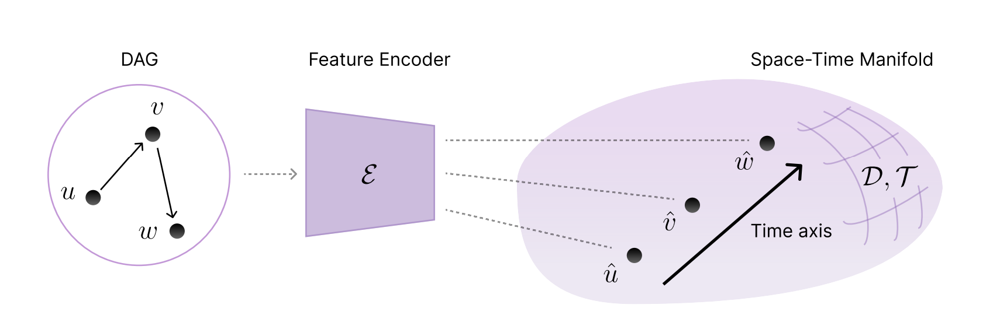
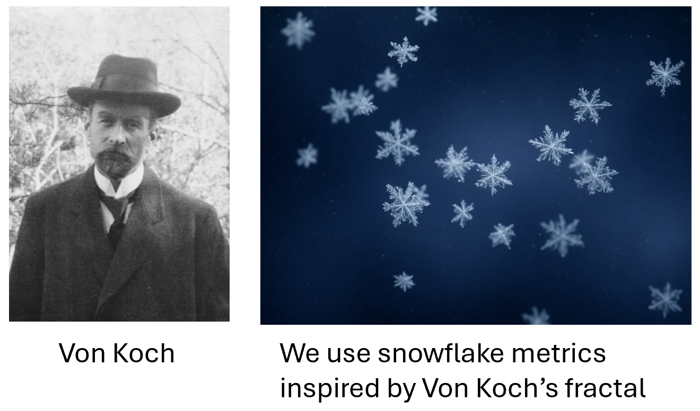

# 🌌 NEURAL SPACETIMES <br> FOR DAG REPRESENTATION LEARNING

[](https://openreview.net/pdf?id=skGSOcrIj7)

We propose a new class of trainable geometric representations called **Neural Spacetimes (NSTs)** for embedding **Directed Acyclic Graphs (DAGs)** into continuous manifolds. Unlike traditional methods that treat structure or causality separately, NSTs encode **edge weights** as spatial distances and **causal directionality** via learnable temporal orderings.

NSTs comprise three neural components:
- **Embedding Network**: Maps input node features to spacetime coordinates.
- **Neural (Quasi-)Metric**: Learns a spatial geometry via fractalesque activations.
- **Neural Partial Order**: Learns a temporal geometry to reflect DAG causality.



📌 **Key Contributions**
- A **universal embedding theorem** for DAGs with $\mathcal{O}(\log(k))$ distortion.
- End-to-end learnable geometries that outperform fixed Minkowski/De Sitter baselines.
- Support for **multi-time dimensions**, improving expressivity for causal modeling.

---

## ❄️ Neural Snowflakes

[](https://arxiv.org/pdf/2310.15003)

**Neural Spacetimes (NSTs)** are a generalization of previous research on **Neural Snowflakes**, in which we showed that it is possible to leverage the topology of Euclidean space equipped with a quasi-metric to construct universal (undirected) graph embedding spaces.

We can use trainable metric snowflakes to learn the optimal latent geometry via gradient descent: instead of only mapping to a fixed geometry, we reshape the latent space geometry itself.



---

## 🔍 Project Overview

This repository contains code and experiments to train and evaluate NSTs on:

- ✅ **Synthetic DAGs** with hand-crafted metrics
- 🌐 **Web hyperlink graphs** (WebKB)
- 🧬 **Gene regulatory networks** (DREAM5)
- 📚 **Large-scale citation graphs** (OGBN-Arxiv)

NSTs consistently achieve **lower distortion** and **better causal embedding** accuracy than closed-form spacetimes.

---

## ⚙️ Installation

To set up the environment using Conda:

```bash
conda env create -f environment.yml
conda activate nst
```

Alternatively, using pip and a virtual environment:

```bash
python3 -m venv nst
source nst/bin/activate
pip install -r requirements.txt
```

Make sure to include `dot` support via Conda if you're using graph visualization (`nx_pydot`, `pydot`, etc.).

⚠️ If you install packages manually (e.g. via pip), make sure you also install Graphviz system tools. You can run:
```bash
conda install -c conda-forge graphviz
```

---

## 🧪 Experiment Guide

This repo supports several experiment types, each in its own folder and independently runnable (code can be redudant between folders). Below are details on how to reproduce results across synthetic, real-world, and large-scale DAGs.

---

### 🧬 Synthetic DAG Embeddings

These experiments live in the `dag_embedding/` folder and focus on embedding synthetically generated DAGs with parametric distance functions.

**Relevant scripts:**
- `dag_generation.py`: Generates synthetic DAGs with configurable metric types.
- `train_dag.py`: Trains the NST model on these DAGs.
- `dag_train_functions.py`: Contains most training logic.
- `closed_form_spacetimes.py`: Implements Minkowski and De Sitter baselines.

**Run all NST experiments:**
```bash
cd dag_embedding
bash experiments.sh              # NST across space/time dimensions
```

**Run fixed-geometry baselines:**
```bash
bash minkowski_baselines.sh      # Minkowski space baseline
bash desitter_baselines.sh       # De Sitter space baseline
```

**Run ablations on graph connectivity:**
```bash
bash varyingtopologies.sh        # Vary DAG sparsity/density
```

---

### 🌐 WebKB & 🧬 DREAM5 DAG Embeddings

These experiments are located in `webkb_embedding/` and `dream_embedding/`.

- For **WebKB**, hyperlink graphs are turned into DAGs via preprocessing.
- For **DREAM5**, regulatory networks are parsed from `.tsv` files in `raw_data/`.

**Run NST embeddings:**
```bash
cd webkb_embedding  # or dream_embedding
bash experiments.sh
```

**Run baseline comparisons (Minkowski / De Sitter):**
```bash
bash baseline_experiments.sh
```

**Run downstream tasks:**
```bash
bash savemodels.sh               # Save NST model checkpoints
bash downstream_experiments.sh   # Evaluate classification with pretrained embeddings
```

---

### 📚 OGBN-Arxiv DAG Embedding

Experiments for embedding large citation networks are in `arxiv_embedding/`.

- Graph is processed using `arxiv_generation.py`.
- Supports NST and baseline experiments with minimal configuration.

**Run Neural Spacetime experiments:**
```bash
cd arxiv_embedding
bash experiments.sh
```

**Run baseline experiments:**
```bash
bash baseline_experiments.sh
```

---

## 📁 Repository Structure

<details>
<summary>Click to expand</summary>

```
NeuralSpaceTimes/

├── arxiv_embedding/             # Embedding experiments for large-scale citation DAGs (OGBN-Arxiv)
│   ├── arxiv_generation.py              # Data processing and DAG construction
│   ├── baseline_experiments.sh          # Run baselines using fixed geometries
│   ├── baseline_train_functions.py      # Training routines for baseline models
│   ├── closed_form_spacetimes.py        # Minkowski and De Sitter space models
│   ├── experiments.sh                   # Launch NST training experiments
│   ├── layers.py                        # Neural network layer components
│   ├── neural_spacetime.py              # Core NST model implementation
│   ├── real_train_functions.py          # Training functions for real-world graphs
│   ├── train_real.py                    # NST training entrypoint
│   └── train_real_baseline.py           # Baseline training entrypoint

├── assets/
│   └── NSTdiagram.png
│   └── vonkoch_and_snowflakes.png

├── dag_embedding/               # Synthetic DAG generation and training
│   ├── closed_form_spacetimes.py        # Baseline manifold geometries
│   ├── dag_generation.py                # Graph generator with parametric metrics
│   ├── dag_train_functions.py           # Training logic for NSTs
│   ├── desitter_baselines.sh            # Run De Sitter baselines
│   ├── experiments.sh                   # Run NST experiments with various configs
│   ├── layers.py                        # Shared network components
│   ├── minkowski_baselines.sh           # Run Minkowski baselines
│   ├── neural_spacetime.py              # NST model for synthetic DAGs
│   ├── train_dag.py                     # Entry point for training NST on synthetic DAGs
│   └── varyingtopologies.sh             # Ablation on different DAG sparsity/connectivity

├── dream_embedding/             # Gene regulatory network (DREAM5) DAG experiments
│   ├── baseline_experiments.sh          # Run fixed-geometry baselines
│   ├── closed_form_spacetimes.py        # Minkowski and De Sitter baselines
│   ├── dream_graph_generation.py        # Parses raw data into DAG form
│   ├── dream_train_functions.py         # Training routines for DREAM5
│   ├── experiments.sh                   # Run NST training for gene graphs
│   ├── layers.py                        # Network architecture layers
│   ├── neural_spacetime.py              # NST implementation for DREAM5
│   ├── train_dream.py                   # Dream5 NST training entrypoint
│   └── raw_data/                        # Raw input files for graph construction
│       ├── DREAM5_NetworkInference_GoldStandard_Network1.tsv
│       ├── DREAM5_NetworkInference_GoldStandard_Network3.tsv
│       └── DREAM5_NetworkInference_GoldStandard_Network4.tsv

├── webkb_embedding/             # DAG embedding for WebKB hyperlink networks
│   ├── baseline_experiments.sh          # Run baselines (Minkowski, De Sitter)
│   ├── baseline_train_functions.py      # Baseline training utilities
│   ├── closed_form_spacetimes.py        # Closed-form space definitions
│   ├── downstream_experiments.sh        # Run downstream node classification
│   ├── experiments.sh                   # Run NST embedding experiments
│   ├── layers.py                        # Model components
│   ├── neural_spacetime.py              # NST architecture definition
│   ├── node_classification.py           # Evaluation script for classification tasks
│   ├── real_generation.py               # Preprocessing scripts
│   ├── real_train_functions.py          # Training loops for real datasets
│   ├── savemodels.sh                    # Save NST model checkpoints
│   ├── train_real.py                    # Run NST training
│   └── train_real_baseline.py           # Run baseline model training

├── README.md                     # Project overview and usage instructions

├── environment.yml

```

</details>

---

## 📜 Citation

If you use this codebase or find Neural Spacetimes useful, please cite:

```bibtex
@inproceedings{
borde2025neural,
title={Neural Spacetimes for {DAG} Representation Learning},
author={Haitz S{\'a}ez de Oc{\'a}riz Borde and Anastasis Kratsios and Marc T. Law and Xiaowen Dong and Michael M. Bronstein},
booktitle={The Thirteenth International Conference on Learning Representations},
year={2025},
url={https://openreview.net/forum?id=skGSOcrIj7}
}
```

```bibtex
@inproceedings{
borde2024neural,
title={Neural Snowflakes: Universal Latent Graph Inference via Trainable Latent Geometries},
author={Haitz S{\'a}ez de Oc{\'a}riz Borde and Anastasis Kratsios},
booktitle={The Twelfth International Conference on Learning Representations},
year={2024},
url={https://openreview.net/forum?id=djM3WzpOmK}
}
```

## 📚 Foundational Work for This Research

```bibtex
@inproceedings{
borde2023neural,
title={Neural Latent Geometry Search: Product Manifold Inference via Gromov-Hausdorff-Informed Bayesian Optimization},
author={Haitz S{\'a}ez de Oc{\'a}riz Borde and Alvaro Arroyo and Ismael Morales L{\'o}pez and Ingmar Posner and Xiaowen Dong},
booktitle={Thirty-seventh Conference on Neural Information Processing Systems},
year={2023},
url={https://openreview.net/forum?id=Gij638d76O}
}
```

```bibtex
@inproceedings{
borde2023latent,
title={Latent Graph Inference using Product Manifolds},
author={Haitz S{\'a}ez de Oc{\'a}riz Borde and Anees Kazi and Federico Barbero and Pietro Lio},
booktitle={The Eleventh International Conference on Learning Representations },
year={2023},
url={https://openreview.net/forum?id=JLR_B7n_Wqr}
}
```

```bibtex
@inproceedings{
borde2023projections,
title={Projections of Model Spaces for Latent Graph Inference},
author={Haitz S{\'a}ez de Oc{\'a}riz Borde and Alvaro Arroyo and Ingmar Posner},
booktitle={ICLR 2023 Workshop on Physics for Machine Learning},
year={2023},
url={https://openreview.net/forum?id=Eu42jQQgDc}
}
```
